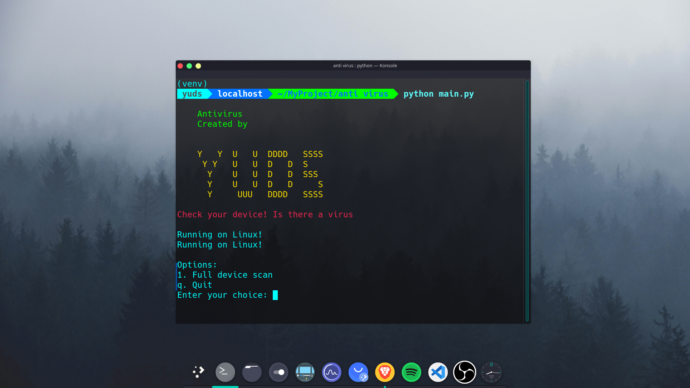

# Antivirus CLI Tool



Antivirus CLI Tool is a command-line-based antivirus software that supports Linux, Windows, and macOS. This tool is designed to help users easily scan, update, and manage file security. The project includes features such as file scanning, antivirus database updates, and additional utilities to protect your device.

## Installation

### Prerequisites
- **Git** must be installed on your system.
- Python 3.8 or later.

#### Install Git
##### Linux
- **Debian/Ubuntu**:
  ```bash
  sudo apt update
  sudo apt install git
  ```
- **Fedora**:
  ```bash
  sudo dnf install git
  ```
- **Arch Linux**:
  ```bash
  sudo pacman -S git
  ```
- **openSUSE**:
  ```bash
  sudo zypper install git
  ```

##### Windows
- Download the Git installer from [Git's official website](https://git-scm.com/) and follow the instructions.

##### macOS
- Use Homebrew:
  ```bash
  brew install git
  ```

#### Install Virtual Environment (venv)
##### Linux/macOS
Use pip to install the `venv` module if it is not available:
```bash
sudo apt install python3-venv  # For Debian/Ubuntu
sudo dnf install python3-venv  # For Fedora
```

##### Windows
`venv` is usually available with Python on Windows. Ensure you have the correct Python version.

### Project Installation Steps
1. Clone the repository:
   ```bash
   git clone https://github.com/yudiiansyaah/antivirus-cli.git
   cd antivirus-cli
   ```

2. Create and activate a virtual environment:
##### Linux/macOS
   ```bash
   python3 -m venv venv
   source venv/bin/activate
   ```
##### Windows
   ```cmd
   python -m venv venv
   venv\Scripts\activate
   ```

3. Install dependencies:
   ```bash
   pip install -r requirements.txt
   ```

### Running the Tool
Run the `main.py` file to use the tool:
```bash
python main.py
```

## Troubleshooting

- **Git is not installed**:
  Install Git following the instructions above.

- **venv is not installed**:
  Ensure `venv` is installed as per the guidance in the prerequisites section.

- **venv is not activated**:
  Activate the virtual environment as instructed for your operating system.

- **Dependencies are not installed**:
  Re-run the following command in the virtual environment:
  ```bash
  pip install -r requirements.txt
  ```

If other issues occur, carefully read the error messages to identify the cause.

## License
This project is licensed under the [MIT License](LICENSE).

## Folder Structure
```plaintext
antivirus_tool/
├── antivirus/
│   ├── init.py
│   ├── banner.py
│   ├── scanner.py
│   ├── updater.py
│   └── utils.py
├── tests/
│   ├── test_scanner.py
│   ├── test_updater.py
│   └── test_utils.py
├── main.py
├── setup.py
├── requirements.txt
└── README.md
|____screenshoot.png
```
